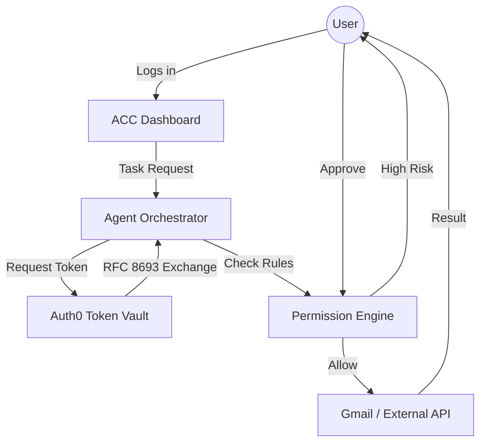

# 🛡️ Agent Control Center (ACC)
### *Next-Generation Zero-Trust Orchestration for AI Agents*

[](https://auth0.com)
[](https://nextjs.org)
[](https://datatracker.ietf.org/doc/html/rfc8693)
[](LICENSE)

**Agent Control Center** is a production-grade security bridge for AI Agents. It decouples agent logic from user identity using **Auth0 Token Vault**, enabling agents to perform sensitive tasks (like summarizing Gmail) without ever seeing a single long-lived credential.

---

## 🚀 Key Features

*   **🔒 Token Vault Integration (RFC 8693)**: Uses OAuth 2.0 Token Exchange to convert user identities into short-lived, connection-specific access tokens.
*   **🚦 Human-in-the-Loop (HITL)**: High-risk actions (e.g., deleting drafts, sending emails) require manual one-tap approval from the dashboard.
*   **🛡️ Permission Engine**: A "Deny-by-Default" security layer that monitors every agent action against a granular policy.
*   **📜 Immutable Audit Trail**: Every single API call, decision, and token exchange is logged with cryptographic fingerprints.
*   **⚡ Next.js 15+ Core**: Built on the latest App Router architecture with serverless-ready route handlers.
*   **🎨 Premium UI**: Apple-style dark mode dashboard with real-time activity feeds and security stats.

---

## 🏗️ Architecture



---

## 🛠️ Tech Stack

- **Frontend**: Next.js, React, Vanilla CSS (Premium Dark Theme)
- **Security**: @auth0/nextjs-auth0 (V4 SDK), RFC 8693 Token Exchange
- **Database**: SQLite (better-sqlite3) for persistent audit logs
- **Language**: TypeScript (Strict Mode)

---

## 📦 Getting Started

### 1. Requirements
- Node.js 22+
- Auth0 Tenant with **Connected Accounts** enabled.

### 2. Configure Environment
Create a `.env.local` file:
```bash
# Auth0 App Config
AUTH0_SECRET='use [openssl rand -hex 32]'
AUTH0_BASE_URL='http://localhost:3000'
AUTH0_DOMAIN='your-tenant.auth0.com'
AUTH0_CLIENT_ID='...'
AUTH0_CLIENT_SECRET='...'

# Token Vault
AUTH0_CONNECTION_GOOGLE='google-oauth2'
```

### 3. Install and Run
```bash
npm install
npm run dev
```
Navigate to `http://localhost:3000`.

---

## 🛡️ Security Posture

### Secretless Execution
The Agent logic runs in a "Secretless" environment. It never handles User Refresh Tokens. Instead, it requests a 1-hour scoped token from the Vault for the specific sub-task, minimizing the impact of any potential breach.

### Granular Guardrails
Unlike generic AI agents, ACC defines strict rules:
- `gmail.list`: **Allow** (Low Risk)
- `gmail.send`: **Approval Required** (High Risk)
- `gmail.delete`: **Deny** (Critical Risk)

---

## 🏆 Hackathon Goals
- [x] Full Migration from Legacy Express to Next.js Modern Stack.
- [x] Zero-Trust Token Exchange Implementation.
- [x] Real-time Audit Trail & Approval Queue.
- [x] Premium Minimal UX.

Developed with ❤️ for the Auth0 AI Hackathon.
