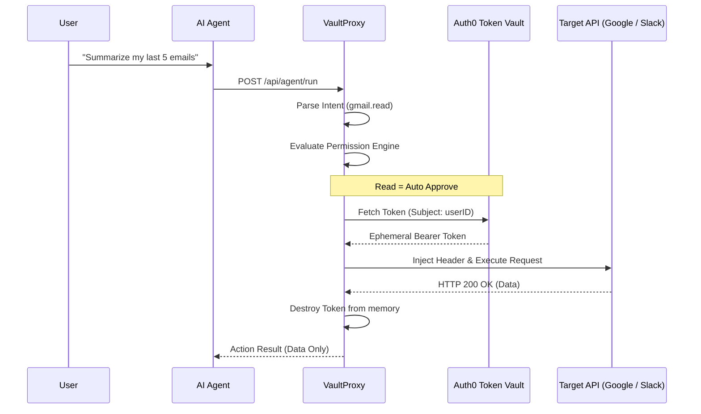

<div align="center">
  

  # VaultProxy 🛡️
  
  **Secure Zero-Trust Middleware for AI Agents**
  
  [](https://auth0.com)
  [](https://nextjs.org/)
  [](https://opensource.org/licenses/MIT)

  *Traditional applications give agents raw access tokens or API keys, creating massive blast-radius vulnerabilities. VaultProxy solves this.*
</div>

---

## 🚀 The Vision: Leashing AI
AI Agents are powerful, but they shouldn't hold the keys to your castle. 

When you authorize an AI agent to "act on your behalf," they typically receive raw OAuth access tokens or API keys injected directly into their environment. If the agent's memory is dumped, or a log file leaks, **your full account is compromised.**

**VaultProxy** introduces a zero-trust architecture. Instead of holding tokens, agents hold *nothing*. They construct intents, pass them to VaultProxy, and VaultProxy fetches ephemeral tokens directly from the **Auth0 Token Vault**, injects them into the HTTP headers, performs the request, and discards the token. The agent never sees the credentials.

## ✨ High-Fidelity Features

1. **🔐 Auth0 Token Vault Integration:** Tokens are stored entirely within Auth0. The Next.js middleware retrieves them dynamically per-request.
2. **🛡️ 3-Tier Permission Engine (Deny-by-Default):**
   - 🟢 **READ Actions** (`gmail.read`): Auto-approved and proxied.
   - 🟠 **WRITE Actions** (`gmail.send`): Quarantined pending Human-in-the-Loop review via the dashboard.
   - 🔴 **DESTRUCTIVE Actions** (`gmail.delete`): Instantly blocked and triggers an Auth0 MFA step-up authentication flow.
3. **📋 Cryptographic Audit Ledger:** An immutable SQLite ledger records every single action, risk level, token fingerprint, and response.
4. **🎨 Premium UI/UX:** Built with Tailwind CSS, Next.js App Router, and Framer-grade CSS animations to deliver a world-class Auth0 security product aesthetic.

## 📸 Dashboard & Control Center

|||
|:---:|:---:|
| **Zero-Trust Token Management** | **Immutable Audit Traces** |

## 🛠️ Architecture Flow


## 💻 Tech Stack
- **Framework:** Next.js 16 (App Router + React Server Components)
- **Auth & IAM:** Auth0
- **Token Storage:** Auth0 Token Vault Management API 
- **Database:** SQLite (Better-SQLite3) for audit logs
- **Styling:** Tailwind CSS + CSS Variables Dark Mode
- **Icons:** Lucide React

## 🏎️ Getting Started

### 1. Prerequisites
- Node.js `v20+`
- An Auth0 Application (Web App)
- Auth0 Management API Application

### 2. Environment Setup
Create a `.env.local` file in the root:
```env
# AUTH0 SECRETS
AUTH0_SECRET='generate-with-openssl'
AUTH0_BASE_URL='http://localhost:3000'
AUTH0_ISSUER_BASE_URL='https://YOUR_TENANT.auth0.com'
AUTH0_CLIENT_ID='your-client-id'
AUTH0_CLIENT_SECRET='your-client-secret'

# MANAGEMENT API
AUTH0_MANAGEMENT_CLIENT_ID='your-mgmt-id'
AUTH0_MANAGEMENT_CLIENT_SECRET='your-mgmt-secret'
AUTH0_DOMAIN='YOUR_TENANT.auth0.com'
```

### 3. Run Locally
```bash
npm install
npm run dev
```
Visit `http://localhost:3000` to dive into the Agent Control Center!

> *Designed with ❤️ for the Auth0 Hackathon 2026.*

## 👥 Team
**VaultProxy** was built by:
- **Sai Dheeraj** ([@Keerth09](https://github.com/Keerth09))

*(If there are other team members, please feel free to add them here!)*

## 📄 License
This project is licensed under the **MIT License**. See the [LICENSE](LICENSE) file for more details.
